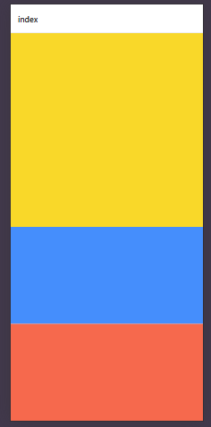

View --> div

require adds whatever is inside to the bundle of the app, making the installation file bigger

# Touchable

when components don't have handle events, we can wrap them in "touchables"
Examples:

- TouchableWithoutFeedback
- TouchableOpacity
- TouchableHighlight

# Styles

StyleSheet.create:

- Validates the name of the properties

Checking OS:

paddingTop: Platform.OS === "android" ? StatusBar.currentHeight : 0

# Orientation

In `app.json` we can sert the default orientation of the app in `"orientation": "portrait",` or `landscape` or `default` for both modes

# Flex

flex 1 occupies all the available space. If there are multiple siblings, the flex number will be proportional, for example:

```
      <View style={{
        backgroundColor: "#fff",
        flex: 1
      }}>
        <View style={{
          backgroundColor: "gold",
          flex: 2
        }}></View>
        <View style={{
          backgroundColor: "dodgerblue",
          flex: 1
        }}></View>
        <View style={{
          backgroundColor: "tomato",
          flex: 1
        }}></View>
      </View>
```



## Flex orientation

By default is vertical, we can change it on the parent:

```
flexDirection: "row",
flexDirection: "row-reverse",
flexDirection: "column",
flexDirection: "column-reverse",
```

## Alignment

in container --> `justifyContent: "center"`, centers in the principal axis, depending if it's row or column
Other options:

```
justifyContent: "space-evenly"
justifyContent: "space-between"
justifyContent: "space-around"
```

## All combined

```
flexDirection: "row", // Sets main axis
justifyContent: "center", // Justifies on main axis
alignItems: "center" // Justifies in secondary axis
alignContent: "center", // No efect if there is no wrapping
flexWrap: "wrap"

flexBasis: 100, // Sets to width of height depending on which is the main axis, row or column
flexGrow: 1 // Same as flex
flexShrink: 1, // If there is overflowing, reduce this item until they fit. Same as flex: -1
```

These propierties on the container can be overwritten in the child with `alignSelf`

# Positioning
